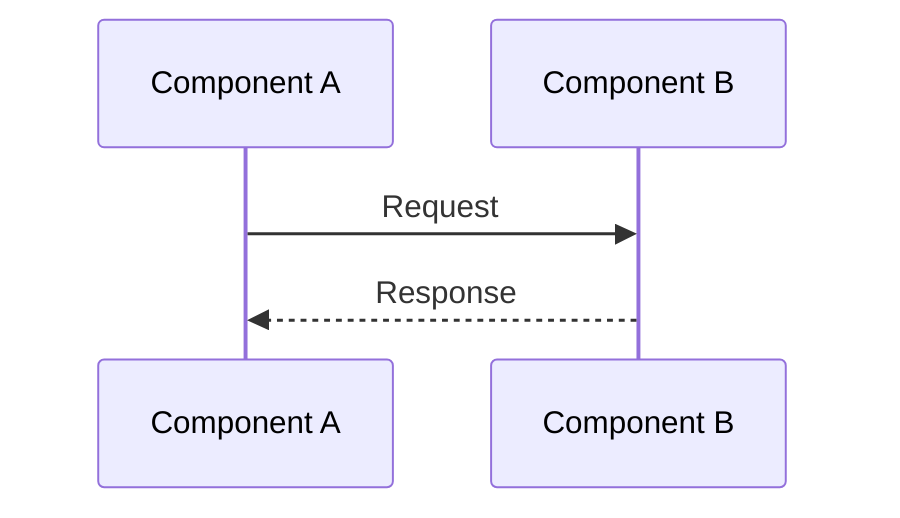
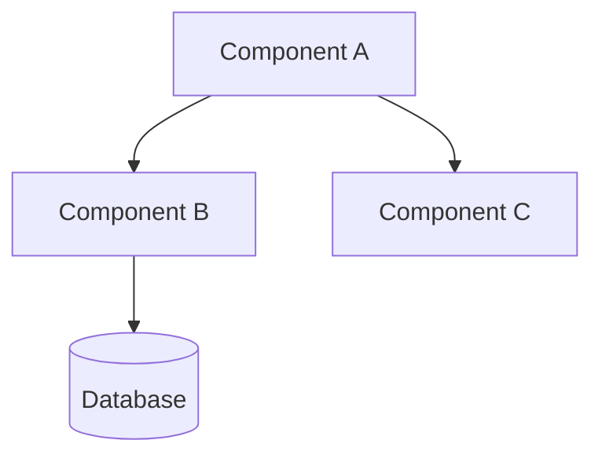
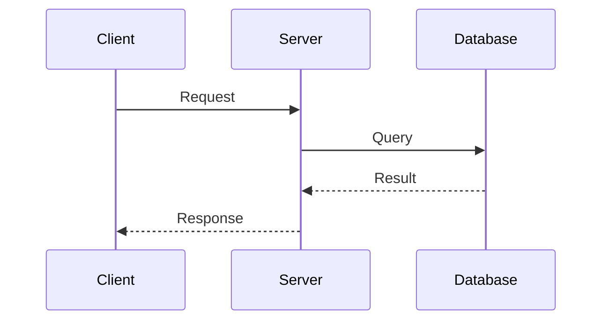
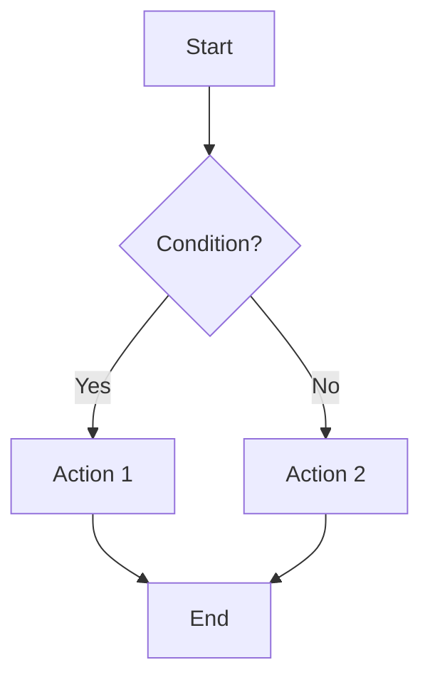

# Document Structure Templates

Standard structures for analysis documents.

## General Analysis Document

```markdown
# [Document Title]

## 概述
Brief overview of what this document covers and its scope.

## 架构设计
Architecture and design patterns observed.

### 组件关系
[Mermaid diagram showing component relationships]

### 设计模式
Design patterns used and why.

## 核心实现

### [Component/Feature 1]
Detailed analysis with code examples.

```go
// path/to/file.go
func Example() {
    // Code with inline comments
}
```

### [Component/Feature 2]
...

## 关键流程

### [Flow Name]
[Mermaid sequence or flowchart diagram]

Step-by-step explanation of the flow.

## 技术细节

### 配置管理
How configuration is handled.

### 错误处理
Error handling strategies.

### 并发控制
Concurrency patterns if applicable.

## 性能考虑
Performance implications and optimizations.

## 最佳实践
Notable patterns worth adopting.

## 总结
Key takeaways and insights.
```

## Service Analysis Document

```markdown
# [Service Name] 服务分析

## 概述
Service purpose and responsibilities.

## 服务接口

### RPC/API 定义
```protobuf
// proto/service.proto
service Example {
    rpc Method(Request) returns (Response);
}
```

### 接口说明
| 方法 | 用途 | 参数 | 返回 |
|------|------|------|------|

## 核心实现

### 服务初始化
Initialization and lifecycle.

### 业务逻辑
Core business logic implementation.

### 数据访问
How data is accessed and managed.

## 依赖关系

### 上游依赖
Services this service depends on.

### 下游依赖
Services that depend on this service.

## 错误处理
Error handling and retry strategies.

## 性能优化
Performance considerations specific to this service.

## 总结
```

## Flow Analysis Document

```markdown
# [Flow Name] 流程分析

## 概述
What this flow accomplishes.

## 流程概览



## 详细步骤

### 步骤 1: [Step Name]
**位置**: `path/to/file.go:lineNumber`
**说明**: What happens at this step.

### 步骤 2: [Step Name]
...

## 数据转换
How data transforms through the flow.

## 错误场景
What happens when things go wrong.

## 性能瓶颈
Where bottlenecks might occur.

## 优化建议
Potential improvements.
```

## Summary Document

```markdown
# [Topic] 总结

## 执行摘要
High-level summary for quick reading.

## 关键发现

### 架构亮点
Notable architectural decisions.

### 技术选型
Technology choices and rationale.

### 设计模式
Patterns observed throughout.

## 评估

### 优势
Strengths of the implementation.

### 改进空间
Areas that could be improved.

## 建议

### 短期改进
Quick wins.

### 长期规划
Larger improvements.

## 附录
References to detailed documents.
```

## Mermaid Diagram Templates

### Component Diagram


### Sequence Diagram


### Flowchart

