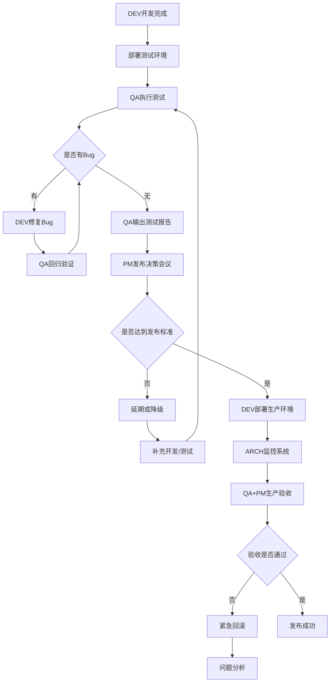

# 发布流程

## 流程概述
- **目的**：确保版本高质量、安全、顺利发布
- **触发条件**：开发完成，准备发布新版本
- **参与角色**：QA（主导验收）、DEV、PM、ARCH

## 流程阶段

### 阶段1：提测准备
- **负责角色**：DEV
- **输入**：开发完成的功能代码
- **活动**：
  - 完成功能开发和单元测试
  - 代码合并到测试分支
  - 部署到测试环境
  - 进行自测和冒烟测试
  - 准备提测文档（功能清单、变更说明）
- **输出**：测试环境可用版本、提测文档
- **完成标准**：核心功能可正常访问，无明显报错

### 阶段2：测试执行
- **负责角色**：QA
- **输入**：测试环境版本、提测文档、测试用例
- **活动**：
  - 执行功能测试（验证需求实现）
  - 执行回归测试（验证老功能未受影响）
  - 执行兼容性测试（多浏览器、多设备）
  - UI走查（验证设计还原度）
  - 记录和跟踪Bug
- **输出**：Bug清单、测试报告
- **完成标准**：所有测试用例执行完毕，Bug记录清晰

### 阶段3：Bug修复
- **负责角色**：DEV
- **输入**：Bug清单
- **活动**：
  - 分析Bug原因并修复
  - 在测试环境验证修复效果
  - 提交修复代码并更新测试环境
  - 通知QA进行回归验证
- **输出**：Bug修复版本
- **完成标准**：所有阻塞和严重Bug已修复

### 阶段4：发布决策
- **负责角色**：PM（决策）、QA（质量评估）
- **输入**：测试报告、Bug统计
- **活动**：
  - QA汇报测试结果和质量评估
  - PM评估剩余Bug的业务影响
  - 团队讨论是否满足发布标准
  - PM做出发布决策（发布/延期/降级）
- **输出**：发布决策、发布计划
- **完成标准**：发布决策明确，发布时间确定

### 阶段5：生产发布
- **负责角色**：DEV（执行）、ARCH（监控）
- **输入**：发布决策、发布计划
- **活动**：
  - 代码合并到生产分支并打Tag
  - 执行数据库迁移脚本（如需要）
  - 部署到生产环境
  - 执行生产环境验证
  - 监控系统指标和错误日志
- **输出**：生产环境新版本
- **完成标准**：生产环境运行正常，核心指标无异常

### 阶段6：发布验收
- **负责角色**：QA + PM
- **输入**：生产环境版本
- **活动**：
  - QA在生产环境执行验收用例
  - PM验证核心业务流程
  - 收集用户初期反馈
  - 监控数据指标（转化率、错误率等）
- **输出**：验收报告、发布总结
- **完成标准**：生产验收通过，无用户投诉

## 流程图

## 异常处理

| 异常情况 | 处理方式 | 决策角色 |
|----------|----------|----------|
| 严重Bug无法及时修复 | 延期发布或移除该功能 | PM |
| 测试环境不稳定 | DEV排查环境问题，必要时重建 | DEV + ARCH |
| 生产发布失败 | 立即回滚到上一版本 | ARCH + DEV |
| 生产环境性能下降 | ARCH排查性能瓶颈，必要时回滚 | ARCH |
| 用户投诉激增 | PM紧急评估，决定是否回滚 | PM + ARCH |
| 数据迁移失败 | 停止发布，ARCH修复数据后重试 | ARCH |
