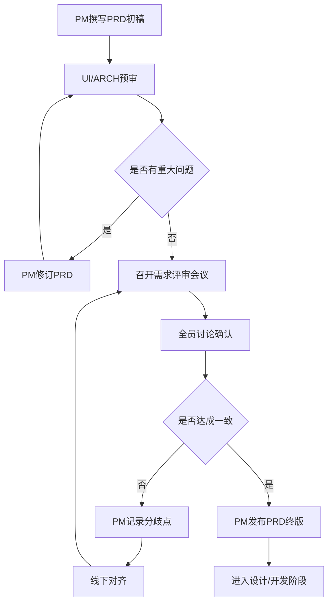

# 需求评审流程

## 流程概述
- **目的**：确保需求清晰、可行、各方对齐
- **触发条件**：产品经理完成PRD初稿
- **参与角色**：PM（主导）、UI、ARCH、DEV、QA

## 流程阶段

### 阶段1：需求文档准备
- **负责角色**：PM
- **输入**：业务需求、用户反馈、市场调研
- **活动**：
  - 撰写产品需求文档（PRD）
  - 绘制用户故事地图和流程图
  - 明确验收标准和优先级
- **输出**：PRD初稿（包含背景、目标、功能清单、用例）
- **完成标准**：需求文档结构完整，功能描述清晰

### 阶段2：需求预审
- **负责角色**：UI、ARCH
- **输入**：PRD初稿
- **活动**：
  - UI评估交互复杂度和设计工作量
  - ARCH评估技术可行性和架构影响
  - 提出疑问和优化建议
- **输出**：预审意见清单
- **完成标准**：无重大技术阻塞点，设计方向明确

### 阶段3：需求评审会议
- **负责角色**：PM（主持），全员参与
- **输入**：PRD终稿、预审意见
- **活动**：
  - PM讲解需求背景和功能细节（15分钟）
  - UI展示交互方案草图（10分钟）
  - ARCH说明技术方案思路（10分钟）
  - 全员讨论边界场景和风险点（15分钟）
  - QA提出测试关注点（5分钟）
- **输出**：评审会议纪要、待办事项清单
- **完成标准**：所有角色对需求理解一致，无重大分歧

### 阶段4：需求确认
- **负责角色**：PM
- **输入**：评审会议纪要
- **活动**：
  - 根据评审意见更新PRD
  - 与相关方确认待办事项处理方案
  - 发布需求最终版本
- **输出**：PRD终版、项目排期
- **完成标准**：PRD锁定，进入设计和开发阶段

## 流程图

## 异常处理

| 异常情况 | 处理方式 | 决策角色 |
|----------|----------|----------|
| 技术实现不可行 | ARCH提供替代方案或降级方案 | ARCH + PM |
| 需求范围过大 | PM拆分为多个迭代，定义MVP | PM |
| 各方理解不一致 | 会后单独对齐，必要时二次评审 | PM |
| 缺少关键信息 | 暂停评审，PM补充调研后再评 | PM |
| UI设计周期冲突 | 调整排期或简化设计方案 | PM + UI |
