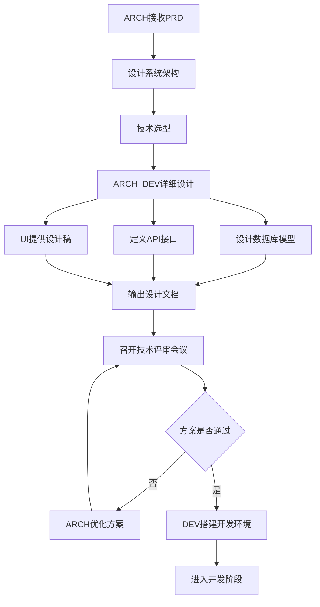

# 技术设计流程

## 流程概述
- **目的**：将产品需求转化为可落地的技术方案
- **触发条件**：需求评审通过，PRD终版发布
- **参与角色**：ARCH（主导）、DEV、UI、PM

## 流程阶段

### 阶段1：架构设计
- **负责角色**：ARCH
- **输入**：PRD终版、现有系统架构
- **活动**：
  - 分析功能需求，识别技术挑战点
  - 设计系统架构图（分层、模块划分）
  - 进行技术选型（框架、中间件、第三方服务）
  - 评估性能和扩展性风险
- **输出**：技术架构文档、技术选型报告
- **完成标准**：架构方案清晰，技术栈确定

### 阶段2：详细设计
- **负责角色**：ARCH + DEV
- **输入**：技术架构文档
- **活动**：
  - 设计数据库模型（ER图、表结构、索引）
  - 定义API接口规范（RESTful/GraphQL）
  - 设计核心类图和时序图
  - 制定代码规范和Git分支策略
  - UI提供设计稿和组件规范
- **输出**：数据库设计文档、API文档、类图、UI设计稿
- **完成标准**：技术细节明确，可直接指导开发

### 阶段3：技术评审
- **负责角色**：ARCH（主持），DEV参与
- **输入**：完整技术设计文档
- **活动**：
  - ARCH讲解架构设计和关键技术点（20分钟）
  - DEV提出实现疑问和潜在风险（15分钟）
  - 讨论技术方案的替代选项（10分钟）
  - PM确认技术方案对需求的支撑度（5分钟）
  - 确定开发任务拆分和排期（10分钟）
- **输出**：评审意见、技术方案终版、开发任务清单
- **完成标准**：技术方案达成共识，任务分工明确

### 阶段4：开发准备
- **负责角色**：DEV
- **输入**：技术方案终版、开发任务清单
- **活动**：
  - 搭建开发环境和项目脚手架
  - 创建数据库和初始化表结构
  - 配置CI/CD流水线
  - 准备测试环境
- **输出**：可运行的项目骨架、环境配置文档
- **完成标准**：开发环境就绪，可开始编码

## 流程图

## 异常处理

| 异常情况 | 处理方式 | 决策角色 |
|----------|----------|----------|
| 技术方案无法满足需求 | 与PM沟通调整需求或降级方案 | ARCH + PM |
| 技术选型存在争议 | ARCH提供对比分析，团队投票决策 | ARCH + DEV |
| 第三方依赖不可用 | ARCH寻找替代方案或自研 | ARCH |
| 数据库设计与现有冲突 | 评估迁移成本，决定兼容或重构 | ARCH |
| 开发环境搭建困难 | DEV寻求ARCH支持，必要时调整技术栈 | DEV + ARCH |
