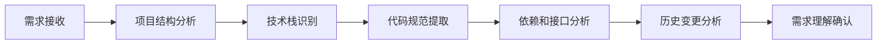
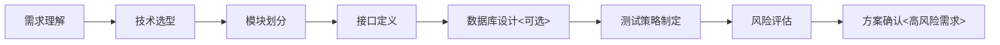
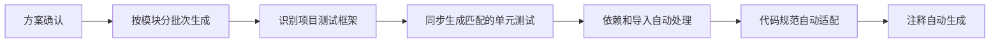
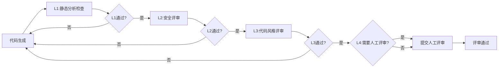
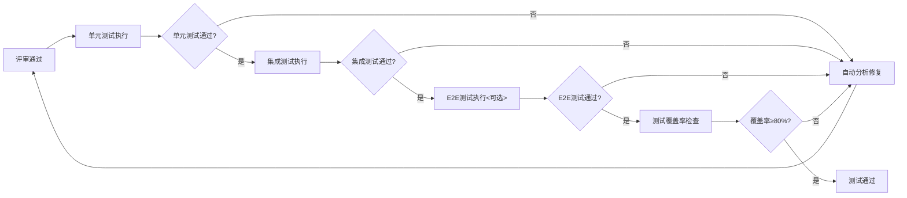
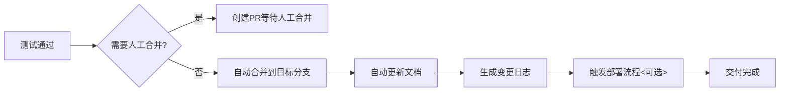

# Auto Code Engineer 自动代码开发技能

## 概述
Auto Code Engineer 是一个全流程自动代码开发技能，能够根据用户需求自动完成从需求分析到上线的完整开发周期。它集成了代码评审、工作区管理、自动化测试和代码合并功能，采用可扩展架构设计，支持灵活添加新的技术栈支持。

## 核心功能
1. **全流程开发自动化**：从需求分析、方案设计、代码生成、测试验证到代码合并的完整流程自动化
2. **多场景支持**：新功能开发、Bug修复、代码优化、代码评审全场景覆盖
3. **多层质量保障**：静态代码检查、AI多轮评审、自动化测试的三层质量保障体系
4. **可扩展架构**：通过插件化方式支持新的编程语言、框架和工具
5. **测试框架自动适配**：自动识别并适配项目现有单元测试框架，生成匹配的测试用例
6. **智能上下文感知**：自动分析项目结构、技术栈、代码规范，生成符合项目风格的代码

## 适用场景
- 用户明确提出开发需求（新功能、模块、系统等）
- 用户报告Bug需要修复
- 用户需要优化现有代码（性能、可读性、可维护性等）
- 用户需要代码评审和改进建议
- 自动响应Issue和PR触发的开发任务
- 批量代码重构和技术债务清理

## 核心流程

### 1. 需求接收与上下文分析


- 自动收集项目上下文信息，包括结构、技术栈、规范、依赖等
- 分析需求的复杂度和影响范围
- 如有歧义，主动向用户确认需求细节

### 2. 方案设计


- 输出完整的技术方案文档
- 对于高风险或复杂需求，主动向用户确认方案后再进行开发
- 方案包含技术选型、模块划分、接口定义、测试策略等

### 3. 代码生成


- 按照模块优先级分批次生成代码
- 自动识别项目现有单元测试框架（如pytest、Jest、JUnit等）
- 生成与项目测试框架完全匹配的单元测试用例
- 保证语法零错误、类型安全
- 自动遵循项目的代码风格和规范
- 生成清晰完整的代码注释

### 4. 多轮代码评审


**评审层级：**
- **L1评审**：静态分析工具自动检查（语法、Lint、类型安全）
- **L2评审**：AI安全评审（漏洞、性能反模式、业务逻辑正确性）
- **L3评审**：AI代码风格评审（符合项目规范、可读性、可维护性）
- **L4评审**：人工评审（所有变更都需要人工确认后才能合并）

每轮评审不通过则自动返回代码生成阶段迭代修正，直到所有自动化检查通过，然后提交人工评审确认。

### 5. 测试验证


- 自动运行所有相关测试
- 测试失败自动分析原因并修复
- 强制要求测试覆盖率≥80%
- 自动生成测试报告

### 6. 合并交付


**合并条件：**
- 所有自动化评审通过
- 所有测试通过
- 经过人工评审确认

## 输出规范

### 开发报告格式
```markdown
# 开发任务完成报告
## 任务概述
- 需求描述：[需求内容]
- 任务类型：[新功能/Bug修复/优化/评审]
- 影响范围：[模块列表]
- 耗时：[X分钟]
- Token使用量：[XXX]

## 实现方案
[简要描述技术方案和设计思路]

## 代码变更
- 修改文件数：[X]
- 新增代码行数：[X]
- 删除代码行数：[X]
- 主要变更点：
  - [变更点1]
  - [变更点2]

## 质量报告
- 评审结果：[全部通过/存在X个问题已修复]
- 测试结果：[X个测试通过，0个失败]
- 测试覆盖率：[X%]
- 安全检查：[通过/存在X个风险已修复]

## 后续建议
[可选：后续优化建议、注意事项等]
```

### PR描述格式
```markdown
## 变更描述
[简要描述变更内容和目的]

## 关联Issue
[关联的Issue编号，如 #123]

## 变更类型
- [ ] 新功能
- [ ] Bug修复
- [ ] 性能优化
- [ ] 代码风格优化
- [ ] 文档更新
- [ ] 其他：[说明]

## 检查清单
- [ ] 代码遵循项目规范
- [ ] 已添加相关测试
- [ ] 所有测试通过
- [ ] 测试覆盖率≥80%
- [ ] 已评审相关代码
- [ ] 已更新相关文档

## 测试报告
[附上测试报告摘要]
```

## 技术栈扩展
技能采用可扩展架构，支持通过添加扩展包的方式支持新的技术栈：

### 扩展结构
```
extensions/tech-stacks/[技术栈名称]/
├── spec.md               # 技术栈特性和规范说明
├── best-practices.md     # 最佳实践指南
├── templates/            # 代码模板目录
│   ├── component.tpl     # 组件模板
│   ├── service.tpl       # 服务模板
│   └── test.tpl          # 测试模板
├── lint.config           # Lint配置文件
├── test.config           # 测试框架配置
└── deploy.config         # 部署配置
```

### 支持的技术栈（默认）
- Python（Django/Flask/FastAPI）
- JavaScript/TypeScript（React/Vue/Node.js）
- Java（Spring Boot）
- Go
- Rust
- 数据库（MySQL/PostgreSQL/MongoDB/Redis）

## 最佳实践
1. **需求明确**：尽可能提供详细的需求描述，包括预期功能、约束条件、验收标准等
2. **小步迭代**：建议将大需求拆分为多个小任务，提高开发效率和质量
3. **及时反馈**：对生成的代码和方案及时反馈，帮助技能不断优化
4. **核心代码评审**：对于核心模块的变更，建议进行人工评审后再合并
5. **定制规则**：可以通过添加自定义评审规则来适配团队的特殊规范

## 安全说明
- 所有生成的代码都会经过安全漏洞扫描
- 不会生成包含已知安全漏洞的代码
- 对于敏感操作（如数据删除、权限修改）会主动向用户确认
- 所有操作都会留下审计日志，便于追溯

## 限制说明
- 对于过于复杂或模糊的需求，可能需要多次确认才能准确实现
- 生成的代码可能需要根据实际场景进行微调
- 对于非常前沿或小众的技术栈，可能需要先扩展支持
