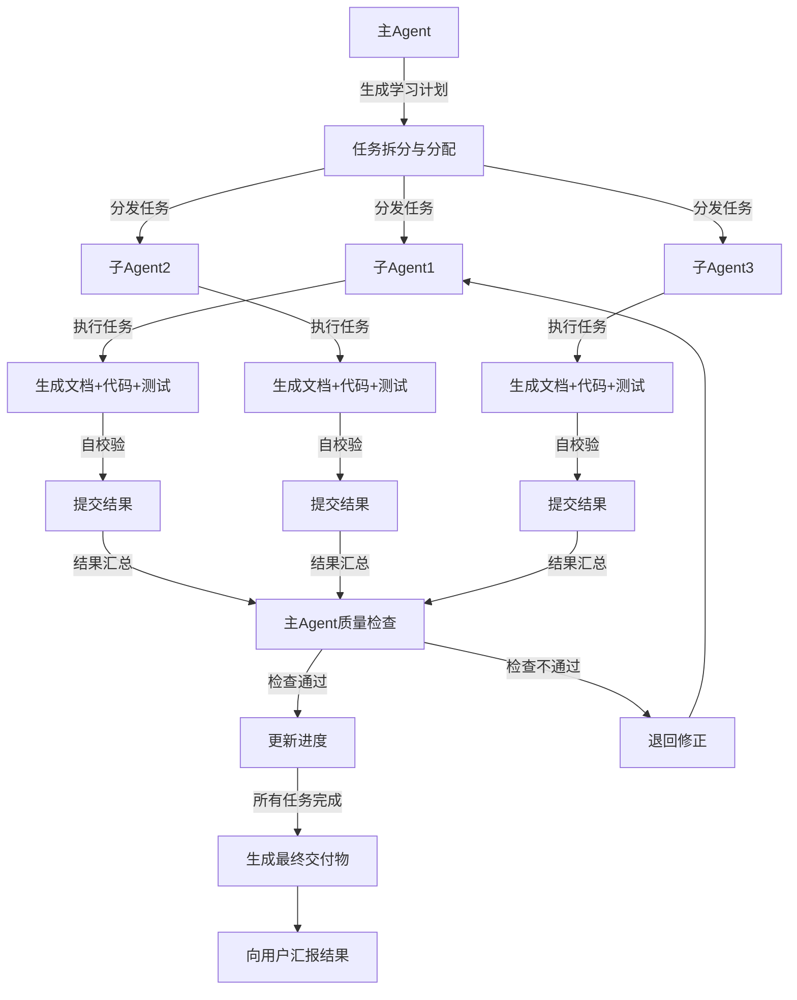

# 多 Agent 协作规范（Java 特定）

> 本文档是 `references/agent-coordination-base.md` 的 Java 特定版本。
> 通用部分请参考基础文档，本文档仅包含 Java 特定的配置和示例。

## Java 特定配置

### 子 Agent 能力要求

- 精通 **Java 技术栈**的特定领域
- 能够独立完成高质量的内容生成
- 具备严格的质量意识

### 任务分配策略（Java 特定）

根据子 agent 的专长分配对应领域的任务：
- 基础语法任务 → 分配给擅长基础的 agent
- **并发编程任务** → 分配给擅长多线程的 agent
- **JVM 相关任务** → 分配给擅长 JVM 的 agent

### 任务输出规范

```typescript
{
  "output_spec": {
    "document_path": "docs/[知识点名称].md",
    "code_path": "src/main/java/com/example/java/learning/[知识点名称].java",
    "test_path": "src/test/java/com/example/java/learning/[知识点名称]Test.java"
  }
}
```

## 执行流程规范（Java 特定）

### 内容生成

- 编写学习文档（遵循 document-structure.md 规范）
- 编写代码示例（符合 **Oracle Java Coding Conventions** 规范，可编译运行）
- 编写单元测试（使用 **JUnit 5**）

### 自校验清单

- [ ] 文档结构符合规范要求
- [ ] 内容准确，没有概念错误
- [ ] 代码示例可以正常编译运行（`mvn compile`）
- [ ] 单元测试全部通过（`mvn test`）
- [ ] 格式符合 Oracle Java Coding Conventions 规范
- [ ] 没有错别字和表述错误

### 代码验证命令

**编译验证**：
```bash
mvn compile
# 或
javac
```

**测试执行**：
```bash
mvn test
```

## 质量检查（Java 特定）

### 格式检查

- 文件命名是否符合规范（PascalCase for classes）
- 文档结构是否完整
- 代码格式是否符合 **Oracle Java Coding Conventions** 规范
- Markdown 格式是否正确

### 代码风格规范

| 元素 | 规范 |
|------|------|
| 类名 | PascalCase |
| 方法名 | camelCase |
| 变量名 | camelCase |
| 常量名 | UPPER_SNAKE_CASE |

## 示例：多 Agent 执行流程



## 参考资源

- **通用规范**：见 `references/agent-coordination-base.md`
- **文档结构**：见 `language-plugins/java/references/document-structure.md`
- **粒度划分**：见 `language-plugins/java/references/granularity-guideline.md`
- **阶段模板**：见 `language-plugins/java/references/phase-templates.md`
